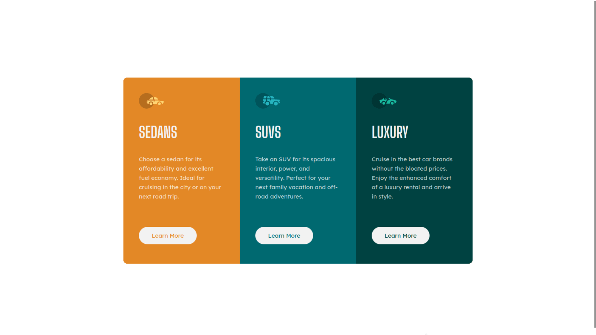

# 3-column preview card component solution

This is a solution to the [3-column preview card component challenge on Frontend Mentor](https://www.frontendmentor.io/challenges/3column-preview-card-component-pH92eAR2-). Frontend Mentor challenges help you improve your coding skills by building realistic projects. 

## Overview

### The challenge

Users should be able to:

- View the optimal layout depending on their device's screen size
- See hover states for interactive elements

### Screenshot

### Links
- Live Site URL: [migueweb.github.io/3-column-preview-card-component/](https://migueweb.github.io/3-column-preview-card-component/)

## My process

### Built with

- Semantic HTML5 markup
- Normalize CSS
- CSS custom properties
- Flexbox
- Mobile-first workflow
- Media queries

## Author
Miguel Amdor
- Github: [@migueweb](https://github.com/migueweb)
- Frontend Mentor: [@migueweb](https://www.frontendmentor.io/profile/migueweb)
